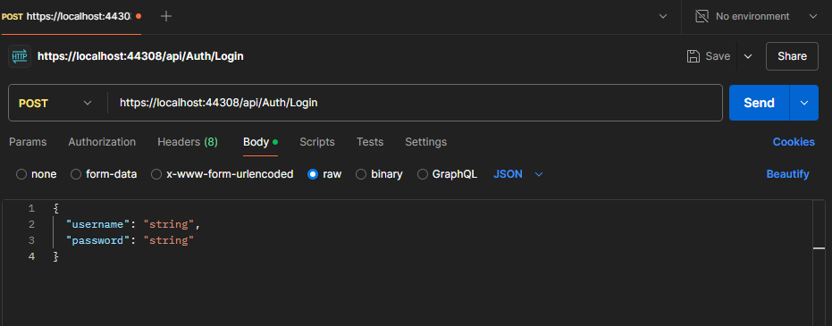
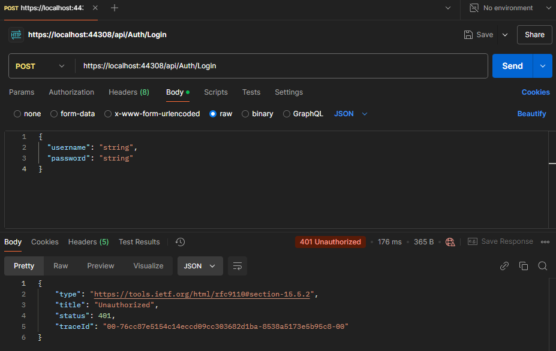
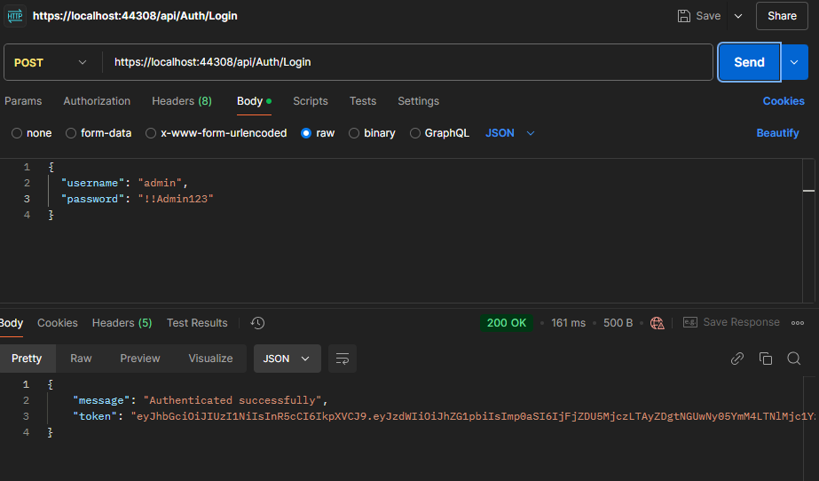
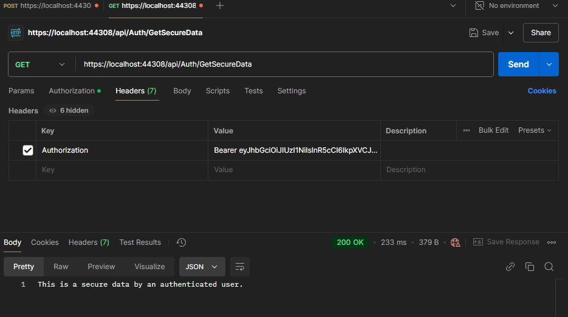

# JwtAuthentication 
In this branch, we created an 'AuthController` class that handles user authentication using JWT (JSON Web Tokens).

## Creating `AuthController` class
- Created a `Login` endpoint in a new class `AuthController` in the `Controllers` directory which will be responsible for handling user authentication.
- The `Login` method will take in a `UserLogin` object as a parameter in the `Login` method.
- We then went ahead to create the `UserLogin` class in a newly created `Models` directory which will be used to validate the user credentials.
- In `appsettings.json` file, we added the below to store `AdminCredentials`:
```Json
{
  "AdminCredentials": {
	"Username": "admin",
	"Password": "!!Admin123"
  }
}
```
- We then went ahead to inject and use this data in the `Login()` method of the `AuthController` class to generate a token for a user trying to log in.
- After doing the above, we created another endpoint `GetSecureData` which will be used to validate the token.
- The `GetSecureData` is a dummy endpoint for other endpoints in our controller class. It will be used to test the authentication of the user. It will return a string "This is a secure data by an authenticated user" if the token is valid and the user is authenticated.

## Registering JwtService in Program.cs
To enable us to use JWT authentication, we registered the `JwtService` in the `Program.cs` file. The `JwtService` is responsible for generating and validating JWT tokens.

```csharp
builder.Services.AddScoped<JwtService>();
```

## Testing the endpoints in Postman
1. Testing the `login` endpoint 
- Open Postman and create a new request.
- Set the request type to POST and enter the URL for the `Login` endpoint (e.g., `https://localhost:{port}/api/Auth/Login`).
- Follow the below screenshot:

- Enter the appropriate username and password.
- Incorrect details will throw a `401 Unauthorized` error as seen below:

- Correct details will give a `200 OK` response as seen below:


2. Testing the `GetSecureData` endpoint
- Create a new request.
- Set the request type to Get and enter the URL for the `Login` endpoint (e.g., `https://localhost:{port}/api/Auth/GetSecureData`).
- Follow the below screenshot:

- An incorrect configuration and/or details will give an error.

## Modifying `Program.cs` to enable authorization in Swagger UI
- Modified the `.AddSwaggerGen` method in the Program.cs file.
```csharp
builder.Services.AddSwaggerGen(c =>
{
    c.SwaggerDoc("v1", new() { Title = "JwtAuthentication Api", Version = "v1" });

    // Enable JWT auth in Swagger
    c.AddSecurityDefinition("Bearer", new Microsoft.OpenApi.Models.OpenApiSecurityScheme
    {
        Name = "Authorization",
        Type = Microsoft.OpenApi.Models.SecuritySchemeType.ApiKey,
        Scheme = "Bearer",
        BearerFormat = "JWT",
        In = Microsoft.OpenApi.Models.ParameterLocation.Header,
        Description = "Enter 'Bearer' [space] and then your valid token.\n\nExample: Bearer eyJhbGciOiJIUzI1NiIs..."
    });

    c.AddSecurityRequirement(new Microsoft.OpenApi.Models.OpenApiSecurityRequirement
    {
        {
            new Microsoft.OpenApi.Models.OpenApiSecurityScheme
            {
                Reference = new Microsoft.OpenApi.Models.OpenApiReference
                {
                    Type = Microsoft.OpenApi.Models.ReferenceType.SecurityScheme,
                    Id = "Bearer"
                }
            },
            new string[] {}
        }
    });
});

```
- Once the bearer token has been generated, click on the `Authorize` button in the Swagger UI and enter the token in the format `Bearer {token}`.
## Common errors to avoid
- Ensure that the `JwtService` is registered in the `Program.cs` file.
- Ensure that the `AdminCredentials` in the `appsettings.json` file is correctly configured.
- Ensure that the `Login` method in the `AuthController` class is correctly implemented.
- Ensure the defined key in `appsettings.json` is at least 32 characters long i.e. 256 bits.
- In production environment, you may want to add the `appsettings.json` file to the `.gitignore` file to avoid exposing sensitive information.